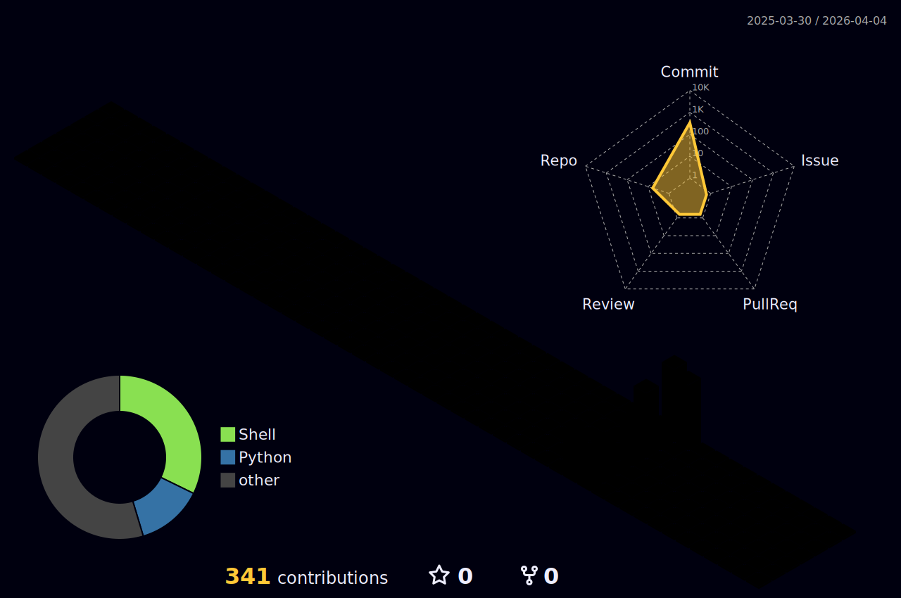

  

  <h2>Hi there, I'm Nelson 👋</h2>
  

    I am a Senior System Administrator with a passion for IT security and automation. My approach is structured and analytical, focusing on securing infrastructure and optimizing workflows through code. Currently transitioning my expertise towards offensive and defensive cybersecurity operations.
  

  <h3>🤝 Connect & Network</h3>
   
  <a href="https://www.linkedin.com/in/IHR_LINK">
  

  <h3>🛠️ Tech Stack & Tools</h3>
   
  
  
  
  
  
    
  
  
  
  
  
    
  
  
  
  
  
    
  
  

  <h3>📚 Currently Learning & Improving</h3>
   
  
<i>Deep diving into Cyber Defense, Pentesting, and Advanced Scripting.</i>

  <b>Cybersecurity & Hacking:</b> Active studies via Udemy, LinkedIn Learning & Coursera. 
  <b>Methodology:</b> OSINT, Network Analysis, System Hardening.

  <h3>📊 System Metrics & Infrastructure</h3>
   
  
   
  

<h3>🔧 Workspace Architecture (Standard: C:\Git)</h3>
 

All systems are managed under <b>ISO/IEC 26514</b> compliant documentation standards.

 

<table width="100%" border="0">
<tr>
<td width="25%" align="center" valign="middle">
<h4>OPERATOR STATUS</h4>
 

  

</td>

<td align="center">
<table border="0">
<thead>
<tr>
<th align="left">Repository</th>
<th align="left">Focus & Purpose</th>
<th align="left">Status</th>
</tr>
</thead>
<tbody>
<tr>
<td align="left"><a href="https://github.com/OPS-Samurai/OPS-Systems"><b>OPS-Systems</b></a></td>
<td align="left">Core configurations & cross-platform sync.</td>
<td align="left"><code>Stable</code></td>
</tr>
<tr>
<td align="left"><a href="https://github.com/OPS-Samurai/Python-Tools"><b>Python-Tools</b></a></td>
<td align="left">Automation helpers & data extraction.</td>
<td align="left"><code>Active</code></td>
</tr>
<tr>
<td align="left"><a href="https://github.com/OPS-Samurai/PowerShell-Toolkit"><b>PowerShell-Toolkit</b></a></td>
<td align="left">General administration & shell utilities.</td>
<td align="left"><code>Stable</code></td>
</tr>
<tr>
<td align="left"><a href="https://github.com/OPS-Samurai/Network-Security-Tools"><b>Network-Security-Tools</b></a></td>
<td align="left">Public network analysis & hardening tools.</td>
<td align="left"><code>Active</code></td>
</tr>
<tr>
<td align="left"><a href="https://github.com/OPS-Samurai/Bash-Toolkit"><b>Bash-Toolkit</b></a></td>
<td align="left">Linux automation & server management scripts.</td>
<td align="left"><code>Stable</code></td>
</tr>
</tbody>
</table>
</td>
<td width="25%" align="center" valign="middle">
<h4>SECOPS METRICS</h4>
 

  

</td>
</tr>
</table>

 

  <h3>⚡ Current Focus & Personal</h3>
   
  🧠 Integrating local <b>System-DNA (YAML)</b> into AI-driven workflows. 
  🔭 Building a cross-platform <b>Jarvis Repository Dashboard</b>. 
  🔧 Precision mechanics meets PowerShell infrastructure. 
  🦸‍♂️ <b>Marvel & DC</b> enthusiast. 
  🎮 Tactical Gamer.  

  <i>"I see a suit of armor around the world."</i>
   
  <b>— Tony Stark</b>
    
  

  <h3>👀 Profile Traffic</h3>
  

